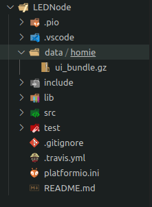
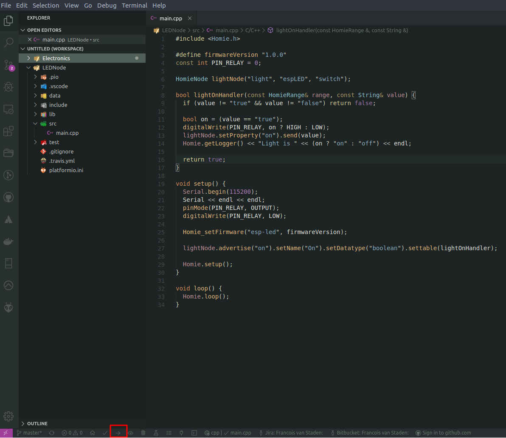
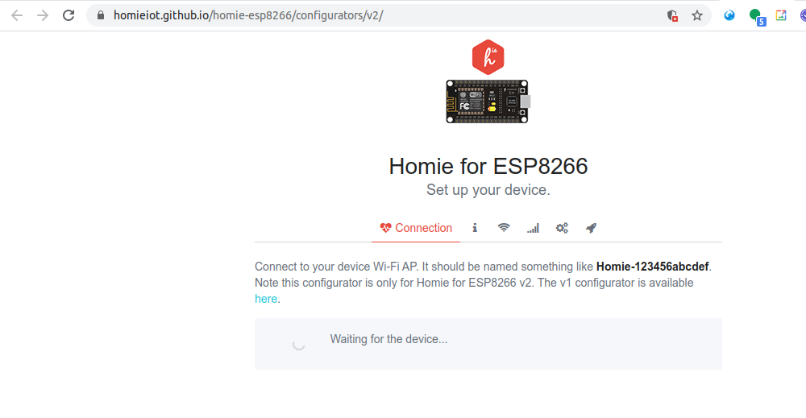

# LEDNode - ESP8266 Homie v3.0.0 Node

This project is a very basic implementation to get started with Homie ESP8266. What makes Homie great is the fact that it standardizes the MQTT messages that the IoT device sends and receives. This has the benefit that platforms like OpenHAB can auto discover your custom IoT devices and knows exactly how to interact with them.

Some other great benefits of using Homie are:
- Reduces the amount of boilerplate code you have to write like managing WIFI connections, MQTT connections, timers, etc.
- It has a great Configuration UI that is provided by an auto generated AP when the node is in configuration mode.
- Supports out of the box Over-The-Air (OTA) updates
- Properly implements deep sleep mode for the ESP

## Flashing Homie to ESP8266

There are various documentation online to explain this process, but there are a few pitfalls along the way. This document tries to simply the explanation of the steps needed to get started with Homie on the ESP8266. At the end the links to the official documentation will also be given.

One of the biggest issues was to connect to the generated access point created by homie. The AP was correctly created and I could connect to it, but the Configuration UI was missing. Once I figured this out (looking at the serial terminal of the device and inspecting the error message) I knew where to start my google search. Loading the UI turned uot to be more of a challenge than I expected...

### Step 1 - Upload the Configuration UI
This is done by uploading the `ui_bundle.gz` file to the SPIFFS of the device.

Start by creating the data folder on the `root` level of the project. It should be on the same level as the `src` directory. Inside the `data` folder, create another folder called `homie`. Inside the `homie` folder, paste the `ui_bundle.gz` file. You can download this file [here](http://setup.homie-esp8266.marvinroger.fr/ui_bundle.gz). Once this is done, your project structure should resemble the one below:



### Step 2 - Upload to the SPIFFS

Now that the configuration UI file is in the `data/homie` directory, it is time to write it to the file system of the device. In PlatformIO this is done by running the task: `platformio ru n --target uploadfs`from the terminal. You can also use the command panel in the IDE:

```shell
Ctrl+p
>Tasks: Run Task
PlatfomIO: Upload File System image
```
This will trigger the command `platformio ru n --target uploadfs`. Wait for the upload to finish

### Step 3 - Upload the Firmware

Now it is time to upload the firmware / sketch. Simply click the upload button in the PlatformIO IDE and wait for the upload to finish.



### Step 4 - Configure the Node

Once you have uploaded your firmware, use your phone or PC to connect to the created access point via WIFI. The AP name will have the format: `Homie-xxxxxxxxxxxx`, like `Homie-c631f278df44`. Once your device is connected to the AP, go to http://192.168.123.1. This will load the configuration website:



From this point onwards it is quite easy. Simply go though the UI and setup the WIFI connection, MQTT Broker, etc. Onc the configuration is done, the device will restart is ready to work!

## Original Documentation

- [Getting Started - Homie v3.0.0](https://homieiot.github.io/homie-esp8266/docs/3.0.0/quickstart/getting-started/)
- [Configuration UI - Folder and Files](https://github.com/homieiot/homie-esp8266/tree/develop/data/homie)
- [Uploading files to the file system SPIFFS - PlatformIO IDE](https://docs.platformio.org/en/stable/platforms/espressif8266.html?highlight=spiffs#uploading-files-to-file-system-spiffs)
- [PlatformIO IDE](https://platformio.org/)
- [MQTT Homie - An MQTT Convention for IoT/M2M](https://homieiot.github.io/)